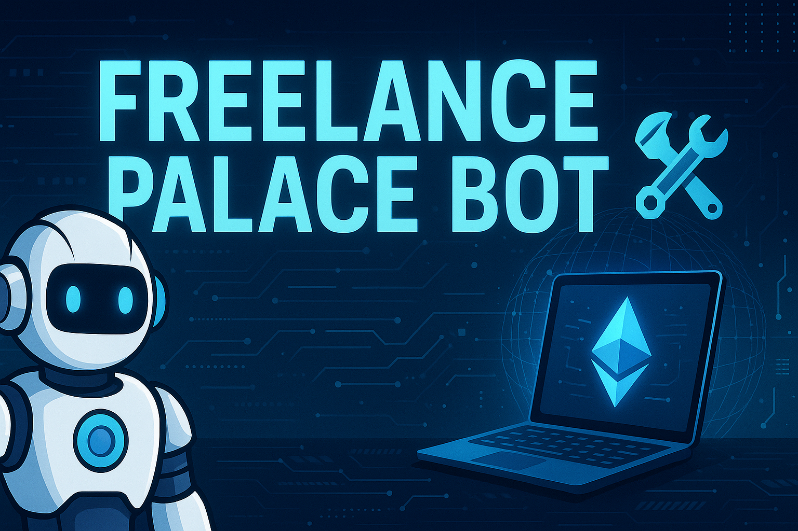

  

# FreelancePalaceBot 🤖🛠️

A smart contract-powered Discord bot for managing ticket-based workflows, support channels, and task coordination within Web3 ecosystems.

## 🔧 Features
- 🎫 Automated ticket creation and closure
- 🧾 On-chain smart contract linking
- 🔒 Role-based access
- 🌐 DAO and freelance integration
- 📦 Modular: Contracts, Scripts, Cogs, Database

## 📁 Folder Structure
- `contracts/` – Solidity smart contracts
- `cogs/` – Discord bot extensions
- `scripts/` – Automation scripts
- `test/` – Bot and contract tests

## 🛠️ Tech Stack
- Discord.js
- Node.js
- Solidity
- Hardhat

👑 Designed for **Freelancers Palace** ecosystem.
